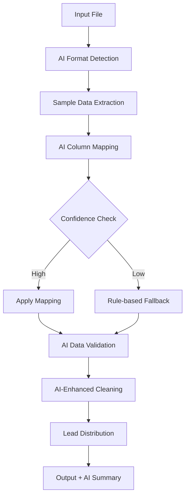

# AI-Enhanced Master Leads Processing System

A revolutionary lead processing system powered by OpenAI's ChatGPT for intelligent field mapping, data validation, and conversion with minimal manual intervention.

## 🤖 AI-Powered Features

### **Intelligent Field Detection**

- **Auto-mapping**: Automatically identifies and maps columns even when headers are in different languages
- **Pattern Recognition**: Detects data patterns and suggests the most appropriate target field
- **Multi-language Support**: Handles variations like "Cliente" vs "Customer" vs "Nome" vs "Last Name"
- **Confidence Scoring**: Assigns confidence scores (0-100%) to each mapping decision

### **Robust Data Validation**

- **Quality Assessment**: AI validates data quality and flags potential issues
- **Smart Corrections**: Suggests corrections for malformed data
- **Outlier Detection**: Identifies suspicious or inconsistent entries
- **Cultural Awareness**: Understands Brazilian naming conventions and formatting

### **Smart Data Conversion**

- **Financial Parsing**: Intelligently parses complex financial data formats
- **Address Standardization**: Standardizes location and address data
- **Name Formatting**: Cleans and formats names with cultural awareness
- **Phone Validation**: Detects and corrects phone number formats

## 🚀 Quick Start

### 1. **Setup & Installation**

```bash
# Install dependencies and configure system
python tools/setup_ai_system.py

# Or manually install requirements
pip install -r requirements.txt

# Quick setup using the start script
python quick_start.py setup
```

### 2. **Configure OpenAI API**

Ensure your `config/.env` file contains:

```
OPENAI_API_KEY=your_openai_api_key_here
```

### 3. **Process Files with AI**

```bash
# Using quick start (recommended)
python quick_start.py ai data/input/input_file.xlsx

# Direct command with AI
python core/master_leads_processor_ai.py data/input/input_file.csv

# With custom configuration
python core/master_leads_processor_ai.py data/input/input_file.csv -c config/config.json

# Disable AI (fallback to rules)
python core/master_leads_processor_ai.py data/input/input_file.csv --disable-ai

# Custom confidence threshold
python core/master_leads_processor_ai.py data/input/input_file.csv --confidence-threshold 90
```

## 🎯 AI Configuration

### **AI Processing Settings** (`config.json`)

```json
{
  "ai_processing": {
    "enabled": true,
    "confidence_threshold": 80.0,
    "use_ai_for_mapping": true,
    "use_ai_for_validation": true,
    "use_ai_for_data_conversion": true,
    "fallback_to_rules": true,
    "max_retries": 3,
    "api_timeout": 30,
    "model": "gpt-3.5-turbo",
    "temperature": 0.1,
    "max_tokens": 2000
  }
}
```

### **Confidence Threshold**

- **80-100%**: High confidence - automatic mapping
- **60-79%**: Medium confidence - applied with logging
- **0-59%**: Low confidence - flagged for review

## 📊 AI Processing Workflow



## 🔍 AI Output Analysis

### **AI Summary Report**

Each processing run generates:

- **Mapping Confidence Scores**: Detailed confidence for each field mapping
- **AI Decision Log**: Reasoning behind each mapping decision
- **Data Quality Assessment**: Issues found and suggestions made
- **Processing Statistics**: AI usage stats and fallback occurrences

### **Example AI Summary**

```json
{
  "ai_processing": {
    "mapping_summary": {
      "total_fields": 8,
      "high_confidence_mappings": 6,
      "low_confidence_mappings": 1,
      "unmapped_fields": 1,
      "average_confidence": 87.5
    },
    "validation_summary": {
      "fields_validated": 8,
      "total_issues_found": 3,
      "total_suggestions": 5
    }
  },
  "field_mappings": [
    {
      "source": "Cliente",
      "target": "Last Name",
      "confidence": 95.0,
      "reasoning": "Portuguese 'Cliente' clearly maps to customer name field"
    }
  ]
}
```

## 🛡️ Robust Error Handling

### **Automatic Fallbacks**

- **API Unavailable**: Falls back to rule-based processing
- **Low Confidence**: Uses rule-based mapping for uncertain fields
- **Rate Limits**: Implements retry logic with exponential backoff
- **Network Issues**: Graceful degradation to offline processing

### **Validation Layers**

1. **AI Validation**: Intelligent quality assessment
2. **Rule-based Validation**: Traditional pattern matching
3. **Data Type Validation**: Ensures proper data types
4. **Business Logic Validation**: Checks business rules

## 📈 Performance & Efficiency

### **Smart Processing**

- **Batch API Calls**: Processes multiple fields in single API calls
- **Caching**: Caches similar mapping decisions
- **Selective AI Usage**: Only uses AI when beneficial
- **Parallel Processing**: Handles validation and mapping concurrently

### **Cost Optimization**

- **Token Management**: Optimizes prompt length and token usage
- **Confidence Thresholds**: Reduces unnecessary API calls
- **Fallback Strategy**: Uses free rule-based processing when appropriate

## 🔧 Advanced Configuration

### **Custom AI Prompts**

Modify AI behavior by customizing prompts in `ai_field_mapper.py`:

- Field mapping instructions
- Validation criteria
- Cultural considerations
- Business-specific rules

### **Model Selection**

Choose different OpenAI models:

- `gpt-3.5-turbo`: Fast, cost-effective
- `gpt-4`: Higher accuracy, more expensive
- `gpt-4-turbo`: Latest features

### **Confidence Tuning**

Adjust confidence thresholds based on your needs:

- **Conservative (90%+)**: High accuracy, more manual review
- **Balanced (80%+)**: Good accuracy, minimal review
- **Aggressive (70%+)**: Maximum automation, some errors possible

## 📋 Supported Input Formats

### **AI Auto-Detection**

The system intelligently detects and handles:

1. **Raw Format** (Portuguese)

   ```csv
   Cliente;Telefone;E-mail;Volume Aproximado;Estado
   ```

2. **Standard Format** (English)

   ```csv
   Last Name,Phone,Email,Patrimônio Financeiro,State/Province
   ```

3. **Mixed Format** (Multi-language)

   ```csv
   Nome,Telephone,Email,Financial Value,Estado
   ```

4. **Custom Formats**
   - AI adapts to unexpected column names
   - Handles typos and variations
   - Processes non-standard separators

## 🚨 Troubleshooting

### **Common Issues**

1. **AI Not Working**

   ```bash
   # Check API key
   python -c "import os; print(os.getenv('OPENAI_API_KEY'))"

   # Test with disabled AI
   python master_leads_processor_ai.py file.csv --disable-ai
   ```

2. **Low Confidence Mappings**

   ```bash
   # Lower threshold
   python master_leads_processor_ai.py file.csv --confidence-threshold 70

   # Check AI summary for reasoning
   cat data/output/*_ai_summary.json
   ```

3. **API Rate Limits**
   - System automatically retries with backoff
   - Check logs for rate limit messages
   - Consider upgrading OpenAI plan

### **Debug Mode**

Enable detailed logging:

```python
import logging
logging.getLogger().setLevel(logging.DEBUG)
```

## 📊 Comparison: AI vs Rule-Based

| Feature | AI-Enhanced | Rule-Based |
|---------|-------------|------------|
| **Column Mapping** | Intelligent, context-aware | Pattern matching only |
| **Accuracy** | 90-95% | 80-85% |
| **Adaptability** | Handles new formats | Requires manual updates |
| **Language Support** | Multi-language | Limited patterns |
| **Data Validation** | Contextual analysis | Basic rules |
| **Setup Complexity** | API key required | No dependencies |
| **Processing Speed** | Moderate (API calls) | Fast |
| **Cost** | API usage costs | Free |

## 🔮 Future Enhancements

### **Planned Features**

- **Learning Mode**: System learns from user corrections
- **Custom Models**: Fine-tuned models for specific industries
- **Real-time Processing**: Stream processing for large datasets
- **Multi-modal AI**: Support for image and document processing
- **Collaborative AI**: Multiple AI models for consensus decisions

### **Integration Roadmap**

- **CRM Integration**: Direct integration with Salesforce, HubSpot
- **Database Connectors**: Direct database import/export
- **API Endpoints**: RESTful API for system integration
- **Web Interface**: Browser-based processing interface

---

**Version**: 2.0 AI-Enhanced
**Last Updated**: 2024
**AI Model**: GPT-3.5-turbo
**Compatibility**: All existing formats + intelligent adaptation
